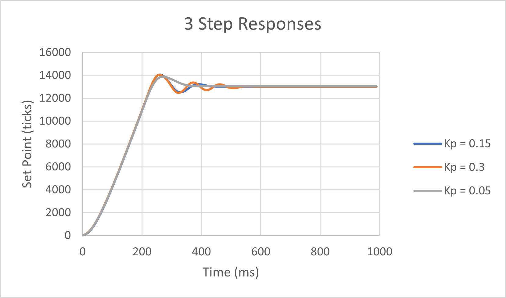

# ME-405 Lab 2
## Motor Control System Plots
   
> For our motor control lab, we tested three different gains for our 
> Proportional controller to see how the step response varied. The 
> P-controller simply multiplies the current error by our gain
> to adjust the motor PWM.
> 
> We first started with 0.15 as our base gain where it shows a little 
> overshoot before reaching steady state. The gain of 0.3 shown in orange 
> shows an identical overshoot with a higher natural frequency while the
> gain of 0.05 in gray has the least overshoot complemented with the 
> quickest settling time. 